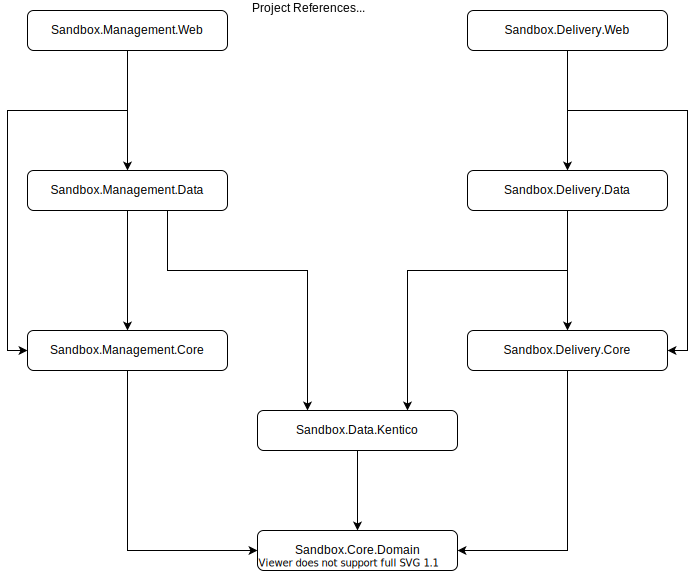

# Clean Kentico12 MVC

An example of Clean/Onion Architecture with [Kentico Xperience 13](https://docs.kentico.com/13)

## Repository Structure

This repository uses the standard .NET approach of a mono-repo, with multiple projects, and deployable units, all contained in a single solution.

There are two deployable units in a Kentico Xperience 13 application, the Content Management (ASP.NET 4.8 Web Forms) application and the Content Delivery (ASP.NET Core 3.1 MVC) application.

In the directory structure below, we can see the separation of these deployable units by top level folders, `delivery`, `management`, with `shared` container projects shared between both deployable units.

```bash
📦/
 ┣ 📂docs
 ┣ 📂src
 ┃ ┣ 📂delivery
 ┃ ┃ ┣ 📜Sandbox.Delivery.Core (Core abstractions / POCOs)
 ┃ ┃ ┣ 📜Sandbox.Delivery.Data (Kentico data access)
 ┃ ┃ ┗ 📜Sandbox.Delivery.Web (MVC / Web API)
 ┃ ┣ 📂management
 ┃ ┃ ┣ 📜Sandbox.Management.Core (Core abstractions / POCOs for CM)
 ┃ ┃ ┣ 📜Sandbox.Management.Data (Kentico data access)
 ┃ ┃ ┗ 📜Sandbox.Management.Web (CMS not included)
 ┃ ┣ 📂shared
 ┃ ┃ ┣ 📜Sandbox.Core.Domain (Shared abstractions / POCOs)
 ┃ ┃ ┗ 📜Sandbox.Data.Kentico (Shared Kentico data access)
 ┣ 📂tests
 ┃ ┗ 📂...
 ┗ 📜Sandbox.sln
```



## Goals

Provide a source for architectural guidance and discussion for the Kentico Xperience community when building Kentico MVC applications.

> Note: This is not a seed project. The repository can be cloned and added to a CMS application, but the primary goal here is a sandbox for patterns and architecture.

> Feel free to copy and paste the code here into your projects (with attribution).

## High Level Patterns

- Vertical Slices / Feature Focused
- Thin Controllers
- Request -> Handler -> ViewModel
- CQRS - Query -> Dispatcher -> Handler -> Response
- `Result<T>` and `Option<T>` (no `null`)
- Dependency Injection
- Cross-Cutting Concerns via Decoration
- `NodeAliasPath` routing
- Centralized and type-safe Kentico / Output Caching
- Context Abstractions
- Guard Clauses
- Onion Architecture

## How to Use this Repository

Clone this repository locally and open `Sandbox.sln` in Visual Studio.

Then, explore the code base by following code lens references, and using the documentation and diagrams for explanations.

Optional: Connect the repository to a Kentico Xperience CMS (`Sandbox.Management.Web`) application and database and use debugging and code changes to see how requests / responses flow through the architecture.

## External Resources

- [Enterprise Craftsmanship](https://enterprisecraftsmanship.com/posts/functional-c-handling-failures-input-errors/) - Vladimir Khorikov
- [.NET Junkie](https://blogs.cuttingedge.it/steven/posts/2019/di-composition-models-primer/) - Steven van Deursen
- [ploeh blog](https://blog.ploeh.dk/2015/10/26/service-locator-violates-encapsulation/) - Mark Seeman
- [Los Techies](https://lostechies.com/jimmybogard/2016/10/27/cqrsmediatr-implementation-patterns/) - Jimmy Bogard

## TODO

- [ ] Xperience 13 built-in Dynamic Routing
- [ ] Robust error handling for MVC, Razor Pages, and APIs
- [ ] Demo of Widget/Section architecture
- [ ] Demo of Page Template architecture
- [X] Layout / meta tag infrastructure
- [X] Query caching as cross cutting decorator
- [ ] Robust logging patterns applied via decoration
- [X] Xperience Async data querying
- [ ] Xperience 13 built-in route URL generation
- [ ] Demo of External Auth
- [ ] Demo of client rendered UI integration w/ API